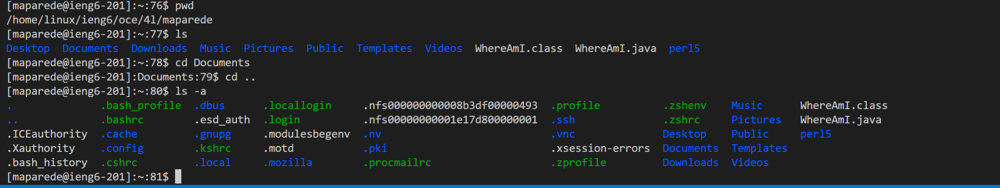

# Tutorial for logging into a course-specific account on `ieng6`

## Installing VScode
Begin by downloading VScode by going to their [website](https://code.visualstudio.com/). Download VScode for your OS, if you are using Windows then you can just click the big blue button on the main page.


## Remotely Connecting
To remotely connect to any course make sure you have downloaded ssh. You can find it by installing it as a package in VScode. Open a new terminal by clicking "Terminal" on the top and clicking on "New Terminal". Then type the following: 
```
$ ssh <school-username>@ieng6.ucsd.edu
```

It will ask you for a password, type in the password you use to login into your school account.


## Trying Some Commands
Feel free to try some commands, here are some examples:
* pwd: list the current directory you are in
* ls: lists all the files and folders in the current directory
* cd: move into a specific folder or move out with `..`
* ls -a: lists all files and directories including hidden files




## Moving files with `scp`
To move files into the ssh without having to do the ssh command you use the `scp` command.
```
$ scp <file> <username>@ieng6.ucsd.edu
```
It will also ask for a password.


## Setting an SSH Key
It takes too much time to login into the SSH when you type the password. An SSH key on your local computer will help you login faster by skipping the password step. Use the following commands to create a public/private rsa key pair:
```
$ ssh-keygen
```
It will prompt you to enter a file to save the key, you can just click Enter. Do not add a passphrase, just click Enter again. Now copy the public key to the .ssh directory by using the following commands:
```
$ ssh <username>@ieng6.ucsd.edu
$ mkdir .ssh
$ scp /Users/<user-name>/.ssh/id_rsa.pub <username>@ieng6.ucsd.edu:~/.ssh/authorized_keys
```

You can now login without inputting a password, it should look like the following:


## Optimizing Remote Running
You can combine different commands into one. Here are some tips!
* It can be too much to login into the ssh just to do one command then exit. To do it all in one command you can use quotes. For example: `$ ssh <username>@ieng6.ucsd.edu "ls"`
* You can also use semicolons to run multiple commands on any terminal. For example you can do `$ ls; pwd` to print all the directories/files and then list the current directory. 

You can combine the previous tips into one command to copy a file into the ssh all while doing multiple commands in there!

```
$ scp <file> <username>@ieng6.ucsd.edu:~/; ssh <username>@ieng6.ucsd.edu "ls; <command-1>; <command-2>"


```


